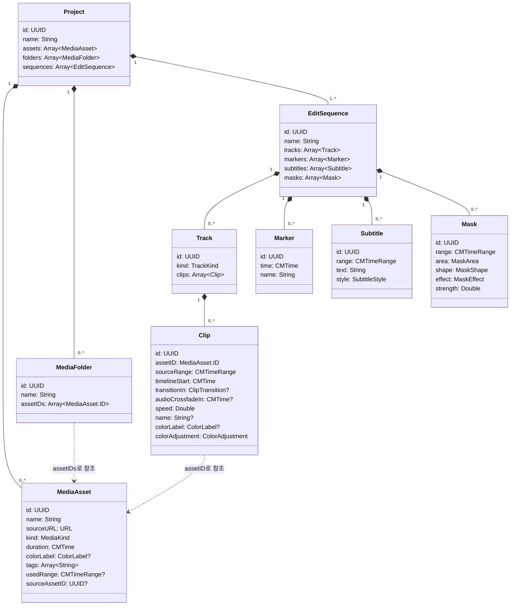

# palladium 도메인 모델 (초안)

## 목적

프로젝트·미디어·시퀀스·트랙·클립이 무엇을 가지고 서로 어떻게 연결되는지, 각 타입이 무엇을 책임지는지 정리한다. 이 문서의 타입은 UI(#12~#17)와 이후 기능 구현이 모두 기대는 공통
기반이며, [테스트 전략](testing-strategy.md)의 원칙대로 View와 미디어 재생·합성 프레임워크에 의존하지 않는 순수 값 타입으로 구현한다.

## 엔티티 관계

## 타입별 책임

| 타입             | 책임                                                          | 비고                                                                      |
|----------------|-------------------------------------------------------------|-------------------------------------------------------------------------|
| `Project`      | 가져온 원본 미디어와 시퀀스를 담는 저장 단위                                   | 새 프로젝트는 빈 시퀀스 하나로 시작한다([프로젝트 저장/불러오기](use-cases/project-management.md)) |
| `MediaAsset`   | 가져온 원본 파일 하나(영상/오디오/이미지)의 정보                                | 미디어 패널에 보이는 항목. 정리용으로 색상 레이블과 태그(자유 텍스트 여러 개)를 갖는다. 타임라인 배치 정보는 갖지 않는다. `name`은 가져올 때 파일 이름으로 채우고 이후 바꿀 수 있다. 원본 위치는 `sourceURL`과 함께 security-scoped bookmark(`bookmarkData`)로 들고 있어 앱을 다시 켜도 연다([파일 접근 권한](file-access-and-sandboxing.md)). 클립 편집 창으로 만든 파생 항목은 쓰는 구간(`usedRange`, 없으면 전체)·크롭(`crop`, #85)과 처음 원본 표시(`sourceAssetID`)를 갖고, 처음 원본의 캐시 키(`mediaKey`)를 같이 쓴다(#81). 원본 항목·파일은 트림·크롭으로 바뀌지 않는다 |
| `MediaFolder`  | 미디어 패널에서 원본을 분류하는 폴더(빈) 하나                                   | 원본을 복사하지 않고 `assetIDs`로 참조한다. 어느 폴더에도 없는 원본은 "분류 안 됨"으로 보여준다. 한 단계뿐이고, 원본은 한 폴더에만 속한다(`Project.moveAssets(_:toFolder:before:)`가 다른 폴더에서 뺀다) |
| `EditSequence` | 독립된 편집 결과물 하나(통합본 또는 하이라이트)                                 | Swift 표준 라이브러리의 `Sequence` 프로토콜과 이름이 겹치지 않도록 `EditSequence`로 짓는다        |
| `Track`        | 시퀀스 안에서 클립이 시간순으로 놓이는 레인 하나                                 | `TrackKind`: `video`, `audio`                                           |
| `Marker`       | 시퀀스의 특정 시각에 붙이는 책갈피(시각 + 이름)                                | 영상 내용은 바꾸지 않는 표시용 정보. 추가·삭제 편집은 [클립 이어붙이기](use-cases/joining-clips.md)(#3)에서 다룬다 |
| `Subtitle`     | 시퀀스(결과물) 시간의 한 구간에 보이는 글자와 모양(`SubtitleStyle` — 크기, 화면 비율 위치(`centerX`·`centerY`, 위·가운데·아래는 빠른 위치), 글꼴(PostScript 이름), 글자색·배경색(`SubtitleRGB`)과 각 불투명도, #4·#82) | 클립과 상관없이 그 시각에 맨 위에 그린다. 시퀀스 길이에 자막 끝도 포함한다. SRT 읽기·쓰기는 `SubtitleFile` |
| `Mask`         | 시퀀스 시간의 한 구간 동안 화면의 고정 영역(`MaskArea` — 화면 비율)을 블러·모자이크로 가린다(사각형·타원, 세기, #59) | 자막 아래, 영상·이미지 위에 적용한다. 시퀀스 길이에는 넣지 않는다([오버레이 및 마스킹](use-cases/overlays.md)) |
| `Clip`         | 원본의 어느 구간(`sourceRange`)을 타임라인의 어느 위치(`timelineStart`)에 놓을지, 화면 어디에 어떻게 그릴지(`transform: ClipTransform` — 위치·배율·불투명도, #9). 쓰임새를 구분하는 별칭(`name`, 없으면 원본 이름)과 색상 레이블(`colorLabel`, #78), 밝기·대비·채도(`colorAdjustment: ColorAdjustment`, #61), 화면 자르기(`crop: ClipCrop` — 위·아래·왼쪽·오른쪽 비율, #85. 트랜스폼은 잘린 화면 기준) | 타임라인에서 차지하는 구간(`timelineRange`)은 저장하지 않고 계산한다(길이 = 원본 구간 ÷ 재생 속도 `speed`, #58) |
| `ClipTransition` | 바로 앞 클립에서 이 클립으로 넘어가는 영상 전환(종류: 디졸브·와이프, 길이). 오디오 크로스페이드는 `Clip.audioCrossfadeIn`(#8) | 앞 클립과 맞닿아 있을 때만 그리고, 그릴 때 두 클립 중 짧은 쪽 길이로 줄인다([트랜지션](use-cases/transitions.md)) |

보조 타입:

- `MediaKind`: `video`, `audio`, `image`
- `ColorLabel`: Finder 태그와 같은 일곱 색(`red`, `orange`, `yellow`, `green`, `blue`, `purple`, `gray`). 원본은 하나만 갖거나 갖지 않는다
- `MediaFilter`: 미디어 패널에서 원본을 거르는 조건(이름·태그 검색어, 색상 레이블). 모든 조건을 만족해야 일치한다
- `TrackKind`: `video`, `audio`

## 설계 결정

### 원본(`MediaAsset`)과 타임라인 클립(`Clip`)을 분리한다

같은 원본을 타임라인에 여러 번 배치할 수 있어야 한다. 원본 정보를 클립마다 복사하지 않고 `MediaAsset` 한 곳에만 두며, `Clip`은 원본을 `assetID`로만 참조한다. 원본 파일 위치가 바뀌어도(relink) `MediaAsset`
하나만 고치면 된다.

### 시간은 `CMTime` / `CMTimeRange`로 표현한다

`Double`(초 단위)은 29.97fps 같은 프레임레이트에서 반올림 오차가 누적된다. `CMTime`은 시간을 분수(value/timescale)로 표현해 프레임 단위로 정확하고, 유즈케이스 문서의 커맨드/쿼리도 이미 `CMTime`을 기준으로
적혀 있다. `CMTime`이 속한 CoreMedia는 재생·합성을 담당하는 AVFoundation과 달리 값 타입만 담은 프레임워크라, 도메인 모델이 이를 import해도 순수성이 유지된다.

### 순수 값 타입으로 만든다

- 모든 도메인 타입은 `struct`/`enum`이다. 대입하면 복사되므로 한 곳의 변경이 다른 곳에 몰래 전파되지 않고, 실행 취소는 이전 값을 보관하는 것만으로 구현할 수 있다.
- `SwiftUI`와 `AVFoundation`을 import하지 않는다(`Foundation`, `CoreMedia`와 값 타입(`CGSize`·`CGRect`)을 위한 `CoreGraphics`만 허용).
- 앱 타깃의 기본 격리가 `MainActor`이므로, 도메인 타입과 그 프로토콜 채택(`extension`)은 `nonisolated`로 선언해 테스트와 백그라운드 작업(내보내기 등)에서도 쓸 수 있게 한다. `extension`에 빠뜨리면 `Equatable` 같은 채택이 메인 액터에 묶여, 메인 액터 밖에서 비교할 때 Swift 6 모드에서 오류가 된다.

### 규칙을 어기는 값은 만들어지지 않게 한다

불변식을 위반하는 값은 실패할 수 있는 이니셜라이저(`init?`)로 생성 단계에서 거부한다. 생성 이후에 "유효한지"를 매번 검사하지 않아도 되게 하기 위함이다.

## 불변식

| 대상        | 규칙                                                         | 보장 방법                        |
|-----------|------------------------------------------------------------|------------------------------|
| `Clip`    | `sourceRange`는 유한한 값이고 길이가 0보다 크며, `timelineStart`는 0 이상이다 | `init?`에서 거부                 |
| `Track`   | 같은 트랙의 클립끼리는 타임라인 구간이 겹치지 않는다                              | 쿼리 `hasOverlappingClips`로 검사 |
| `Project` | 시퀀스가 최소 하나 있다                                              | 새 프로젝트 생성 시 빈 시퀀스 하나를 포함     |

각 불변식은 `palladiumTests`에 Swift Testing 유닛 테스트로 검증한다.

## 샘플 데이터

`#Preview`와 유닛 테스트가 함께 쓰는 샘플은 앱 타깃의 `palladium/domain/SampleData.swift` 한 곳에 둔다. `#Preview`는 앱 타깃 안에서 실행되므로 샘플이 앱 쪽에 있어야 하고, 테스트는
`@testable import palladium`으로 같은 샘플에 접근한다.

## 영속화(SwiftData) 경계

- 프로젝트 파일은 SwiftData 기반 자체 포맷으로 저장한다([기능명세서](video-editing-functional-spec.md) 공통 개념에서 확정).
- 도메인 계층과 영속 계층을 분리한다. 이 문서의 순수 타입이 도메인의 기준이며, 타입별 저장 전용 `@Model` 레코드(예: `ClipRecord`)와 둘 사이의 변환은 영속 계층에 둔다. 도메인은 저장소를 `ProjectRepository`
  프로토콜로만 알고, SwiftData 구현은 영속 계층(`palladium/persistence/`)에 둔다.
- 새 프로젝트는 만드는 즉시 저장되고(`ProjectRepository.createProject(named:)`), 이후 내용 변경은 사용자가 저장해야 반영된다(`ProjectRepository.save(_:)`). 편집 화면은 마지막으로 저장한 프로젝트와 지금 프로젝트를 비교(`Equatable`)해 저장하지 않은 변경을 판단한다.
- 레코드 구성: `ProjectRecord`(목록 정보: id, 이름, 생성일, 수정일, 원본·시퀀스 개수 → 도메인 `ProjectSummary`) 아래에 `MediaAssetRecord`, `MediaFolderRecord`, `SequenceRecord` → `TrackRecord` → `ClipRecord`, `SequenceRecord` → `MarkerRecord`, `SequenceRecord` → `SubtitleRecord`, `SequenceRecord` → `MaskRecord`. 프로젝트나 시퀀스를 지우면 하위 레코드도 함께 지워진다(`cascade`).
- 저장은 무엇이 바뀌었는지 비교하지 않고 하위 레코드를 통째로 교체한다. 빠뜨린 삭제나 순서 변경이 남지 않게 하기 위함이다. 내용이 저장되기 전에 만든 레코드(시퀀스 없음)는 빈 시퀀스 하나로 연다.
- 백업본: 저장하지 않은 변경은 1분(`BackupPolicy.defaultInterval`, 환경설정에서 30초~10분으로 조정, #19)마다, 마지막 백업 이후 또 바뀌었을 때만 `ProjectBackupRecord`(프로젝트당 하나)에 쓴다. 내용은 저장본과 같은 하위 레코드 구조와 변환(`ProjectContentRecords`)을 쓴다. 저장하거나 "저장 안 함"으로 닫으면 지우고, 마지막 저장보다 새 백업본이 남아 있으면(비정상 종료) 프로젝트를 열 때 복구를 묻는다. 복구한 내용은 저장하지 않은 변경 상태로 열린다.
- 영속 계층 구현 시 유의: SwiftData 관계 배열은 순서를 보장하지 않으므로 정렬 인덱스를 별도로 저장하고, `CMTime`은 `value`/`timescale`로 분해해 저장하며, 도메인과 레코드는 같은 `id`를 공유한다.
- Xcode 템플릿의 SwiftData `Item` 모델은 도메인과 무관한 스캐폴딩이다. 메인 윈도우 레이아웃 뼈대(#12)에서 템플릿 `ContentView`를 걷어낼 때 함께 제거한다.

## 이번 범위에서 제외

아래 개념은 해당 기능 이슈에서 이 문서에 추가한다.

- 마커 추가·삭제 편집([클립 이어붙이기](use-cases/joining-clips.md))
- 프록시(#43)([미디어 가져오기](use-cases/media-import.md))
- 재생 속도·역재생([클립 자르기(트림)](use-cases/trimming.md))

## 미정 사항

- 트랙 안의 클립 배열을 항상 `timelineStart` 순으로 정렬된 상태로 유지할지, 조회할 때 정렬할지
