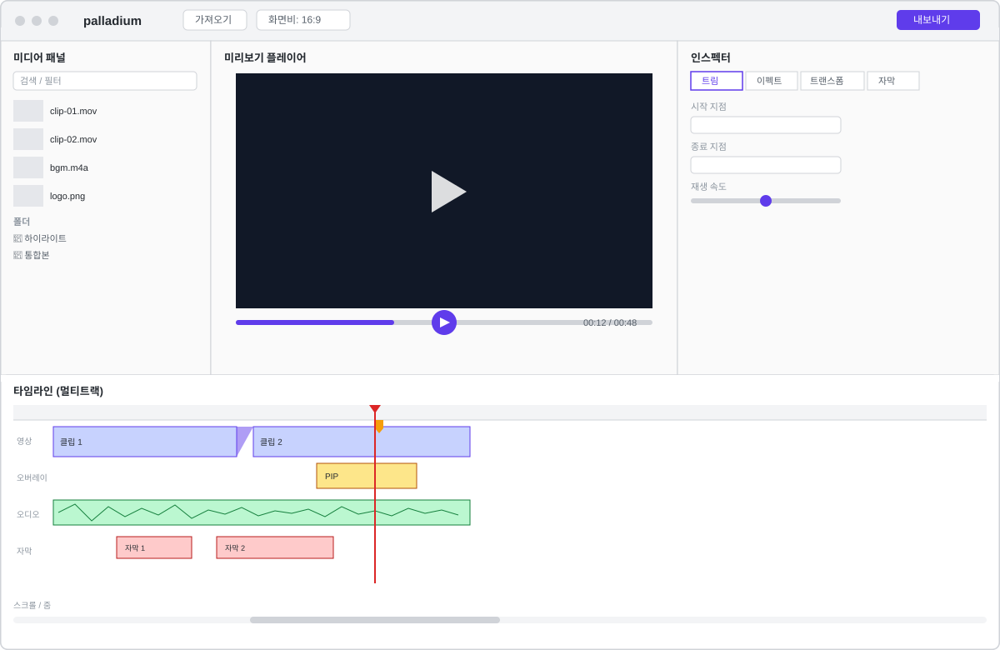

# palladium UI 레이아웃 (초안)

## 목적

메인 편집 화면을 어떤 섹션으로 나눌지, 각 섹션이 어떤 유즈케이스를 담당하는지 정리한다. 상세 디자인이 아니라 레이아웃 구조를 잡기 위한 와이어프레임 수준이며, 색상/타이포그래피 등 구체적인 스타일은 [스타일 가이드](native-style-guide.md)에서 다룬다.

## 전체 구조

> 와이어프레임은 섹션 배치를 보여주는 대략적인 목업이며, 버튼 구성·아이콘·크기 등 세부 사항은 실제 구현과 다를 수 있고 이후 변경에 따라 달라질 수 있다. 구현 시에는 이 문서의 텍스트(섹션 구성, 패널 보기/가리기 표, 컴포넌트 분해)를 기준으로 삼는다.

5개 섹션으로 나눈다.

- **툴바** — 상단, 전체 폭
- **미디어 패널** — 좌측 사이드바
- **미리보기 플레이어** — 중앙
- **인스펙터** — 우측 사이드바(창 전체 높이)
- **타임라인** — 미리보기 플레이어 아래(미디어 패널과 인스펙터 사이). 경계를 드래그해 미리보기와의 높이 비율을 조절한다

미디어 패널·인스펙터가 창 전체 높이를 차지하는 것은 `NavigationSplitView`와 `.inspector`의 표준 동작이다. 타임라인을 창 전체 폭으로 펼치려면 이 표준 컨테이너를 `HSplitView`로 재구현해야 하므로, [스타일 가이드](native-style-guide.md)에 따라 타임라인을 미리보기 아래에 둔다.

### 패널 보기/가리기

JetBrains IDE의 툴 윈도우처럼 패널을 열고 닫을 수 있다.

| 패널 | 툴바 버튼 | 보기 메뉴 | 단축키 |
|---|---|---|---|
| 미디어 패널 | 사이드바 버튼(`NavigationSplitView` 기본 제공) | 사이드바 보기/가리기(시스템 기본) | ⌃⌘S(시스템 기본) |
| 타임라인 | `rectangle.bottomhalf.inset.filled` | 타임라인 보기/가리기 | ⌥⌘2 |
| 인스펙터 | `sidebar.trailing` | 인스펙터 보기/가리기 | ⌥⌘I |

## 섹션별 역할 및 관련 유즈케이스

| 섹션 | 역할 | 관련 유즈케이스 |
|---|---|---|
| 툴바 | 가져오기 진입점, 화면비 프리셋, 내보내기 진입점 | [미디어 가져오기](use-cases/media-import.md), [내보내기](use-cases/export.md) |
| 미디어 패널 | 가져온 클립 목록, 검색·필터, 폴더 정리 | [미디어 가져오기](use-cases/media-import.md) |
| 미리보기 플레이어 | 재생·일시정지·스크러빙, 프레임 단위 이동, 마이크 내레이션 녹음 | [미리보기/재생](use-cases/preview.md), [내레이션 녹음](use-cases/narration-recording.md) |
| 인스펙터 | 선택한 클립의 트림/이펙트/트랜스폼/자막 속성 편집(탭 전환) | [클립 자르기(트림)](use-cases/trimming.md), [자막 삽입](use-cases/subtitles.md) |
| 타임라인 | 멀티트랙 클립 배치, 트림, 트랜지션, 오버레이, 마커, 재생 헤드 | [클립 이어붙이기](use-cases/joining-clips.md), [클립 자르기(트림)](use-cases/trimming.md), [트랜지션](use-cases/transitions.md), [오버레이 및 마스킹](use-cases/overlays.md) |

## 예상 SwiftUI 컴포넌트 분해

macOS 표준 레이아웃 컨테이너(`NavigationSplitView`, `.toolbar`, `.inspector`)를 기준으로 나눈다 — 자세한 근거는 [스타일 가이드](native-style-guide.md)를 참고.

| 섹션 | 예상 View | 비고 |
|---|---|---|
| 툴바 | `ToolbarView` | `.toolbar { ToolbarItemGroup }`로 구현, 가져오기/화면비/내보내기 버튼 |
| 미디어 패널 | `MediaPanelView` | `NavigationSplitView`의 사이드바 컬럼, 검색바 + 클립 리스트 + 폴더 트리 |
| 미리보기 플레이어 | `PreviewPlayerView` | `AVPlayer` 래핑 + 스크럽 바 |
| 인스펙터 | `InspectorView` | `.inspector(isPresented:)`로 구현, 하위 탭별로 `TrimInspectorView`/`EffectInspectorView`/`TransformInspectorView`/`SubtitleInspectorView` 분리 |
| 타임라인 | `TimelineEditorView` | 미리보기 플레이어와 `VSplitView`로 나눈다. 하위에 `TrackRowView`(트랙 한 줄), `ClipView`(클립 블록), `PlayheadView`, `MarkerView`. SwiftUI의 `TimelineView`와 이름이 겹치지 않도록 `TimelineEditorView`로 짓는다 |

## 미정 사항

- 가져오기/내보내기를 모달 시트로 처리할지, 별도 창으로 처리할지
- 인스펙터 패널 폭이 고정인지, 리사이즈 가능한지
- 타임라인 줌/스크롤 UX 세부(단축키, 핀치 줌 지원 여부)
- 아이패드 지원 시점에는 이 레이아웃을 그대로 축소하지 않고 별도로 설계한다([기능명세서](video-editing-functional-spec.md) 원칙 참고)
